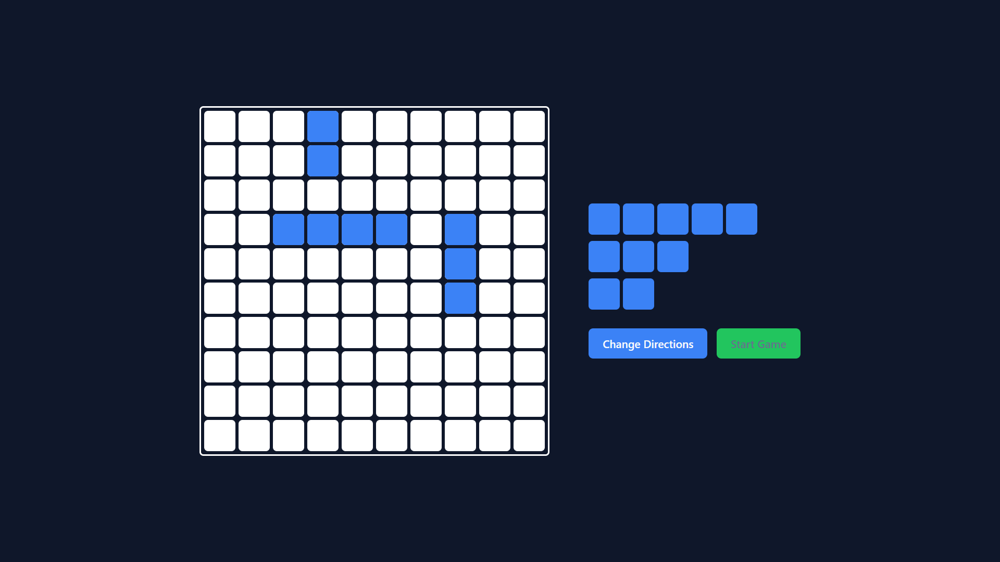
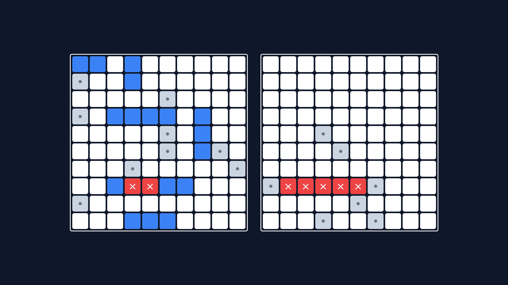

# Battleship [(play)](https://thomasyacoup.github.io/battleship/)

A vanilla JavaScript implementation of the classic [Battleship](https://en.wikipedia.org/wiki/Battleship_(game)) game, built as a learning project for practicing **OOP fundamentals and SOLID principles**.





## Architecture

Logic and UI are kept separate:

```
src/
├── js/
│   ├── modules/
│   │   ├── ship.js         # Ship classes + factory function
│   │   ├── gameCell.js     # Single grid cell state
│   │   ├── gameBoard.js    # 10x10 grid + placement logic
│   │   └── player.js       # Player and ComputerPlayer
│   └── index.js            # Entry point: wires logic to the DOM
├── css/
│   └── style.css
├── tests/                  # There's no real tests right now   
└── index.html
```

The `modules/` classes are UI-agnostic and can be tested in isolation.

## How to Play

1. **Placement Phase** — place your ships on the grid, toggle orientation before placing.
2. **Battle Phase** — take turns attacking the opponent's grid until one fleet is destroyed.

## Run

```bash
npm install
npm start
```

## Test

```bash
npm test
```

## Stack

Vanilla JavaScript (ES6 Classes, Modules) · Webpack · Jest · CSS